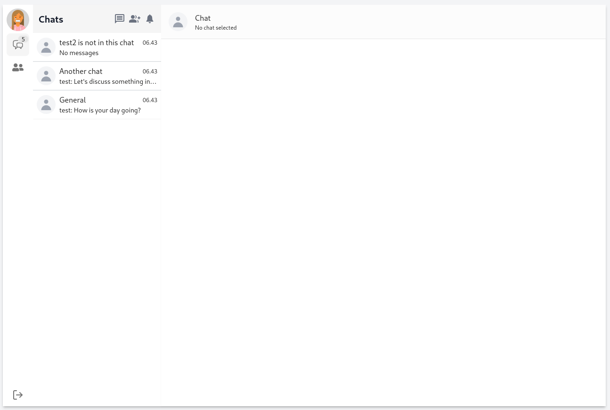
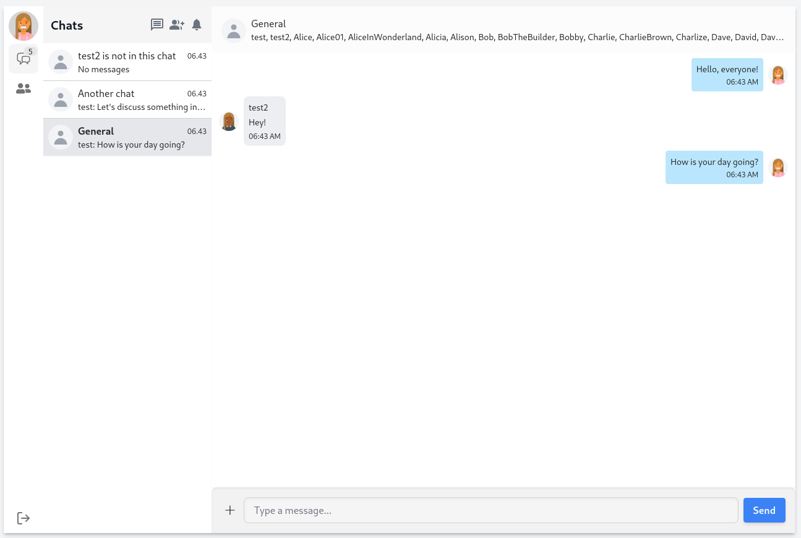

# Fullstack Messenger

## Web Development Project

### Description

This is a fullstack messenger web application developed using **React** and **Node**. The application allows users
to send messages to other users, add and remove friends, create groups and send group messages.

The application is deployed on [Render](https://render.com/) and can be
accessed [here](https://fullstack-messenger.onrender.com/).

### Features

- User authentication
- User authorization
- Create groups
- Group/user profile page
- Send messages to users
- Send messages to groups
- Edit group profile if user is admin
- Add friends
- Remove friends

### Technologies

- [Express](https://expressjs.com/)
- [Postgresql](https://www.postgresql.org/docs/)
- [Sequelize](https://sequelize.org/)
- [Socket.io](https://socket.io/docs/v4/)
- [React](https://react.dev)
- [React Router](https://reactrouter.com/)
- [Tailwind](https://tailwindcss.com/)
- [DaisyUI](https://daisyui.com/)
- [Axios](https://axios-http.com/)
- [Redux](https://redux.js.org/)

### Installation

1. Install [NodeJS](https://nodejs.org/en/)
2. Clone the repository
3. Run `npm install` in the client directory
4. Run `npm install` in the server directory
5. Create a `.env` file in the server directory and add the following variables
    - `PORT`
    - `DB_USER`
    - `DB_PASSWORD`
    - `DB_NAME`
    - `DB_HOST`
    - `DB_DIALECT`
    - `DB_PORT`
    - `JWT_SECRET`
6. Run `npm run dev` in the server directory and `npm start` in the client directory

### Screenshots

                                                                                                                                                                                                                           
