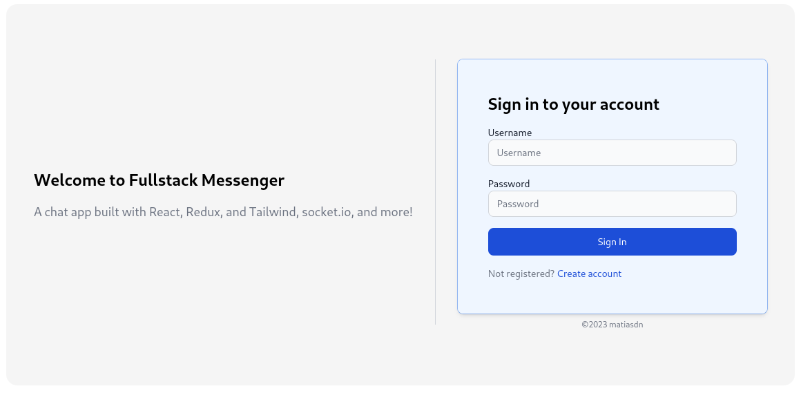
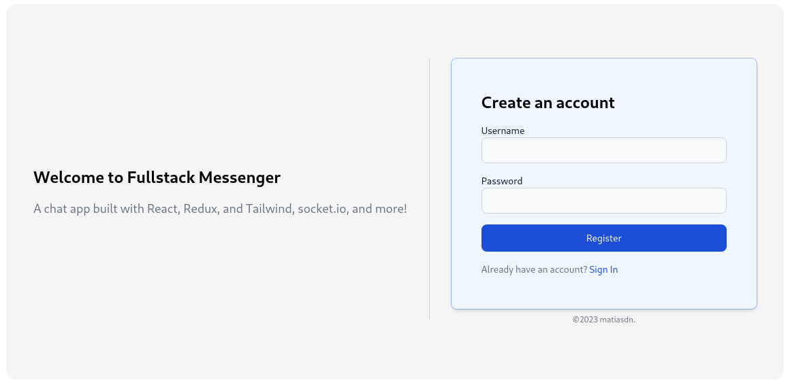

# Fullstack Messenger

## Web Development Project

### Description

This is a fullstack messenger web application developed using **React** and **Node**. The application allows users
to send messages to other users, add and remove friends, create groups and send group messages.

The application is deployed on [Render](https://render.com/) and can be
accessed [here](https://fullstack-messenger.onrender.com/).

### Features

- User authentication
- User authorization
- Create groups
- Group/user profile page
- Send messages to users
- Send messages to groups
- Edit group profile if user is admin
- Add friends
- Remove friends

### Technologies

- [Express](https://expressjs.com/)
- [Postgresql](https://www.postgresql.org/docs/)
- [Sequelize](https://sequelize.org/)
- [Socket.io](https://socket.io/docs/v4/)
- [React](https://react.dev)
- [React Router](https://reactrouter.com/)
- [Tailwind](https://tailwindcss.com/)
- [DaisyUI](https://daisyui.com/)
- [Axios](https://axios-http.com/)
- [Redux](https://redux.js.org/)

### Installation

1. Install [NodeJS](https://nodejs.org/en/)
2. Clone the repository
3. Run `npm install` in the client directory
4. Run `npm install` in the server directory
5. Create a `.env` file in the server directory and add the following variables
    - `PORT`
    - `DB_USER`
    - `DB_PASSWORD`
    - `DB_NAME`
    - `DB_HOST`
    - `DB_DIALECT`
    - `DB_PORT`
    - `JWT_SECRET`
6. Run `npm run dev` in the server directory and `npm start` in the client directory

### Screenshots

### Hour keeping

| Date            | Hours | Description                                                                                                                                                                                                                                                                                                                                                                                                       |
|-----------------|-------|-------------------------------------------------------------------------------------------------------------------------------------------------------------------------------------------------------------------------------------------------------------------------------------------------------------------------------------------------------------------------------------------------------------------|
| April 1, 2023   | 3.5   | Set up the project                                                                                                                                                                                                                                                                                                                                                                                                |
| April 2, 2023   | 7     | initial structure for real-time chat and implemented initial socket.io functionality. Reorganized the project structure                                                                                                                                                                                                                                                                                           |
| April 3, 2023   | 2     | Added initial backend code for setting up the Socket.IO server                                                                                                                                                                                                                                                                                                                                                    |
| April 12, 2023  | 3     | initial commit for the backend and changes to tailwind configuration                                                                                                                                                                                                                                                                                                                                              |
| April 13, 2023  | 12    | Implemented login, routing, and user state management. Updated server to work with current frontend implementation. implemented Redux for managing authentication state.                                                                                                                                                                                                                                          |
| April 15, 2023  | 10    | Improved Sequelize and client implementation. Implemented chat functionality with socket.io.                                                                                                                                                                                                                                                                                                                      |
| April 16, 2023  | 7     | refactoring controllers, fixing types, updating scripts and setups, implemented authentication middleware for api requests. fixed db models.                                                                                                                                                                                                                                                                      |
| April 17, 2023  | 9.5   | implemented Socket.io code and chat features. removed unnecessary components                                                                                                                                                                                                                                                                                                                                      |
| April 18, 2023  | 5     | created scopes for querying db. deleted redundant route and placed <App /> inside a route. updated dependencies and chat card now displays latest message.                                                                                                                                                                                                                                                        |
| April 19, 2023  | 8     | Implemented useState to store active chat messages and adjusted the Socket.IO event to match the backend. New messages are added to the database. fixed dark mode and refactored socket code. Added authentication middleware.                                                                                                                                                                                    |
| April 20, 2023  | 8     | Enforced strict typing across the project and refactored state management.                                                                                                                                                                                                                                                                                                                                        |
| April 21, 2023  | 6     | improved type safety. bug fixes                                                                                                                                                                                                                                                                                                                                                                                   |
| May 16-17, 2023 | 7     | optimize the codebase. Added search user functionality to the server. Added modal to layout.                                                                                                                                                                                                                                                                                                                      |
| May 17, 2023    | 10    | made modal component more generic and added animations. added chat type to chat model. removed unnecessary code and scopes. styling +fixing a problem with messages overflowing their containers.                                                                                                                                                                                                                 |
| May 18, 2023    | 8     | configure backend to use the local database in development mode. check if database exists on start.                                                                                                                                                                                                                                                                                                               |
| May 19, 2023    | 11    | refactoring, and the method names were made more descriptive. Added new form component for group chat creation. add more sample data and move getChats method to userService.                                                                                                                                                                                                                                     |
| May 20, 2023    | 12    | batch add users on setup, use API requests instead of socket events on crud operations.                                                                                                                                                                                                                                                                                                                           |
| May 21, 2023    | 8     | removed some unused constants and added more sample data to the project. Refactor + cleanup                                                                                                                                                                                                                                                                                                                       |
| May 22, 2023    | 2     | fixes to the project.                                                                                                                                                                                                                                                                                                                                                                                             |
| May 23, 2023    | 9     | typing, fixing existing functionalities, implement features: chat invitations and group chat creation. Reimplemented user search using react-select                                                                                                                                                                                                                                                               |
| May 24, 2023    | 8     | models and error handling.                                                                                                                                                                                                                                                                                                                                                                                        |
| May 25, 2023    | 8     | fixed issues related to chat types and associations, removed unnecessary imports, implemented chat invites, and renamed files for better organization.                                                                                                                                                                                                                                                            |
| May 26, 2023    | 10    | add SidebarTab component, extracted child components to improve code organization. Extracted router code from the chat controller. Change require statements to imports.                                                                                                                                                                                                                                          |
| May 27, 2023    | 11    | extracted components from sidebar, implemented lazy loading and fetching of friends and invites,                                                                                                                                                                                                                                                                                                                  |
| May 28, 2023    | 9     | implement shared types. implement the friend list in a similar way as the invite list. added todos. various refactorings, updating property names, adding routes for retrieving invites/requests, refactoring database initialization code, and refactoring invite model initialization. refactored the useChats and useActiveChat hooks. optimized imports, added custom hooks for auth and chat state + styling |
| May 29, 2023    | 13    | multiple commits                                                                                                                                                                                                                                                                                                                                                                                                  |
| June 1, 2023    | 2     | Refactored and reorganized code structure.                                                                                                                                                                                                                                                                                                                                                                        |
| June 2, 2023    | 8     | Refactor and reorganize code base, extracted utility functions to own dir, added fields to user model, implemented getting and sending of chat invites and friend requests, implemented friendService, experiment with associations                                                                                                                                                                               |
| June 3, 2023    | 6     | add type to invite, implement removing friends, fix bugs, update redux state on request status change, implement sending friend requests                                                                                                                                                                                                                                                                          |
| June 4, 2023    | 6     | cleaning up code, adding typings, notify users on friend requests with socket                                                                                                                                                                                                                                                                                                                                     |
| June 5, 2023    | 8     | migrate to vite, styling, async errors and custom error class, implement error handling middleware                                                                                                                                                                                                                                                                                                                |
| June 7, 2023    | 4     | fix remove friend, return/emit changes in user, remove console logs                                                                                                                                                                                                                                                                                                                                               |
| June 9, 2023    | 6     | implement delta updates, add chat info component                                                                                                                                                                                                                                                                                                                                                                  |
| June 10, 2023   | 10    | user now joins chat rooms correctly after accepting invite, refactoring ui to smaller components, implement kicking users from chats, implement updating chat name and bio                                                                                                                                                                                                                                        |
| June 11, 2023   | 2     | refactor                                                                                                                                                                                                                                                                                                                                                                                                          |
| June 12, 2023   | 3     | implement image uploading, chat profile images, notifications                                                                                                                                                                                                                                                                                                                                                     |
| June 13, 2023   | 2     | refactor to use DaisyUI, update dependencies and remove unused code                                                                                                                                                                                                                                                                                                                                               |
| June 14, 2023   | 3     | update layout                                                                                                                                                                                                                                                                                                                                                                                                     |
| June 15, 2023   | 4     | styling                                                                                                                                                                                                                                                                                                                                                                                                           |
| June 16, 2023   | 10    | add drawer,  drawer context,                                                                                                                                                                                                                                                                                                                                                                                      |
| June 17, 2023   | 1     | refactoring components                                                                                                                                                                                                                                                                                                                                                                                            |
| June 18, 2023   | 13    | refactor axios code to use single axios instance and implement interceptors to avoid the need to pass token to every api call. Refactoring Socket.io code                                                                                                                                                                                                                                                         |
| June 19, 2023   | 7     | writing tests, refactoring etc                                                                                                                                                                                                                                                                                                                                                                                    |
| June 20, 2023   | 2     | deploying app                                                                                                                                                                                                                                                                                                                                                                                                     |
| June 26, 2023   | 1     | deploying app                                                                                                                                                                                                                                                                                                                                                                                                     |
| June 27, 2023   | 7     | fixing issues that arise when deploying. Building and deploying. Writing README.                                                                                                                                                                                                                                                                                                                                  |
| total           | 312   |                                                                                                                                                                                                                                                                                                                                                                                                                   |

